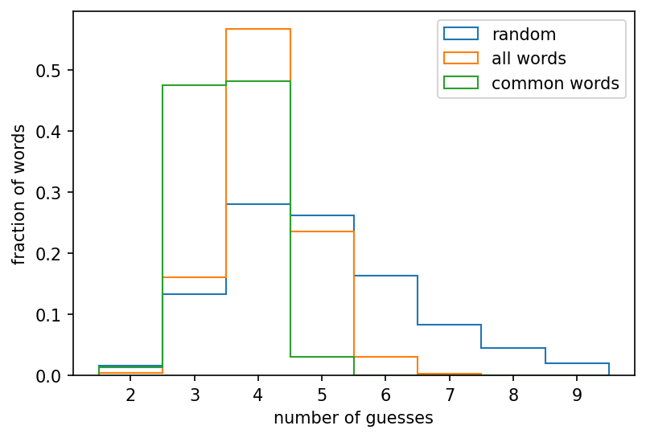

# A wordle simulator

A simulator for experimenting with different strategies for solving the [daily
Wordle puzzle](https://www.powerlanguage.co.uk/wordle/).

## Strategies

There are [2 strategies](src/strategy) implemented here: (1)
[`Baseline`](src/strategy/baseline.rs) a baseline that randomly guesses valid
words, and (2) [`Active`](src/strategy/active.rs) as algorithm that maximizes
the expected information gain at each step.

Simulating the performance of these algorithms for all words in the Wordle
dictionary gives the following results:

where the orange histogram shows the distribution of guesses required when the
solver doesn't know that the correct Wordle is a "common" word. The green
distribution shows our results when we cheat and provide our algorithm with the
known word list from the Wordle source code.

## Usage
